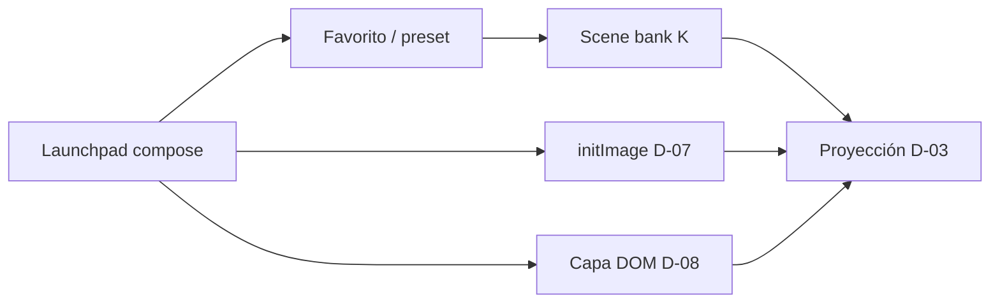

# Composición de escena — scene bank y assets estáticos

> Estado: **planificación / ideas a futuro**. Complementa Epic **D** (proyección) y **K** (scene bank).

Referencias: `docs/glosario-hydra.md`, `skills/favorites-library.skill.md`, `skills/machines.skill.md`, `docs/hydra-skills-index/external-sources/external-sources.md`

---

## Idea 1 — Segundo launchpad: banco de escenas (clip launcher)

### Concepto

Una interfaz tipo **Launchpad de clips** (Ableton / APC): muchos botones, cada uno con una **escena predefinida** (preset completo). El performer **activa/desactiva** visuales en vivo sin armar la cadena pad a pad.

| Launchpad actual | Scene bank (futuro) |
|------------------|---------------------|
| Componer: pads → funciones Hydra | Disparar: preset → escena lista |
| Granularidad: un paso en la chain | Granularidad: escena entera |
| Ideal para diseño / sound design visual | Ideal para performance / show |

No reemplaza al launchpad de composición — es un **segundo modo** o **segunda vista** (`skills/machines.skill.md`: otro tipo de *machine*).

### Qué es una “escena predefinida”

Snapshot serializable (extiende favoritos v2):

```ts
interface ScenePreset {
  id: string
  name: string
  chains: Record<OutputBuffer, ActivePad[]>  // como FavoriteChain
  compiledCode: string
  projectedOutput?: OutputBuffer
  // futuro: staticLayers[], audioSettings, dimmer
}
```

**Relación con favoritos:** mismos datos que `FavoriteChain`; el scene bank añade **layout de botones** + **modo performance** (toggle múltiple).

### Comportamiento toggle (por definir)

| Modo | UX |
|------|-----|
| **Solo una activa** | Tap escena B → reemplaza A (simple) |
| **Varias activas** | Escenas como capas: mezcla o buffers o1+o2 compuestos |
| **Momentary** | Mantener = on, soltar = off (como pad momentary) |
| **Solo en proyección** | Launchpad sigue editando; público ve escenas del bank |

**Recomendación v1:** una escena activa en proyección + transición (fade vía D-06 dimmer).

### UI propuesta

```
┌─────────────────────────────────────┐
│  SCENE BANK          [8×4 grid]     │
│  [■ Intro] [□ Break] [■ Drop] ...   │  ← color = activa
│  tap = toggle · shift = solo preview │
└─────────────────────────────────────┘
```

- Ruta candidata: `/launchpad/scenes` o tab “Scenes” junto a compose
- Teclado: segunda fila de bindings o modo “Scene” (`focusZone`)

### Backlog

| ID | Ítem |
|----|------|
| K-01 | Modelo `ScenePreset` + persistencia (reutilizar favorites-store o fork) |
| K-02 | Grilla N×M de scene buttons (configurable) |
| K-03 | Toggle activar/desactivar escena en proyección |
| K-04 | Importar favorito → slot del scene bank |
| K-05 | Transiciones (dimmer / crossfade entre escenas) |

**Esfuerzo épica:** L · **Prioridad:** media-baja (post D-03 proyección)

---

## Idea 2 — Recursos estáticos (PNG, etc.) en la escena

Componer **más allá del canvas Hydra**: logos, títulos, marcos, PNGs con transparencia.

### Dos capas posibles (conviven)

```
┌─────────────────────────────┐
│  Capa DOM (HTML/CSS)        │  ← PNGs, texto, layout
│  ┌───────────────────────┐  │
│  │ Canvas Hydra (WebGL)  │  │  ← síntesis generativa
│  └───────────────────────┘  │
└─────────────────────────────┘
         ↓ proyección
```

| Enfoque | API | Uso |
|---------|-----|-----|
| **A — Dentro de Hydra** | `s0.initImage(url)` + `src(s0).layer(...).out()` | PNG como textura; efectos Hydra (colorama, blend) |
| **B — Capa DOM** | `` / CSS sobre el stage | Overlays fijos; no pasa por shader; ideal títulos/logos |
| **C — Híbrido** | DOM arriba + Hydra abajo | Escena compuesta real (D-04) |

### Hydra: imágenes como fuente

```js
s0.initImage("/assets/logo.png")
src(s0).scale(0.5).layer(osc(10).mask(shape(4))).out(o0)
render(o0)
```

- Slots `s0`–`s3` (ver external-sources skill)
- Init **async** — primeros frames pueden estar vacíos
- URLs: `public/` del proyecto o blob URLs (upload usuario)

### Asset library (UI futura)

| Feature | Descripción |
|---------|-------------|
| Biblioteca local | `public/scene-assets/` o IndexedDB para uploads |
| Arrastrar PNG al stage | Crea capa DOM o slot `sN` |
| Posición / escala / opacidad | Controles en panel (no pads Hydra) |
| Sync proyección | Incluir lista de capas en `ProjectionMessage` |

### Backlog

| ID | Ítem |
|----|------|
| D-07 | `initImage` + selector de asset en compose (vía `src(sN)`) |
| D-08 | Capas DOM estáticas (PNG) en stage/proyección |
| D-09 | Biblioteca de assets + upload |

**Depende de:** D-03 (proyección), opcionalmente D-04 (escena > canvas)

---

## Relación entre ideas



---

## Decisiones abiertas

1. ¿Scene bank = favoritos con otra UI o store separado?
2. ¿Varias escenas activas a la vez o una sola?
3. ¿PNG en Hydra vs DOM primero? (recomendación: **D-07** antes que D-08 si querés efectos; **D-08** si solo overlay limpio)
4. ¿Assets versionados en repo o solo locales del performer?

---

## Criterios de aceptación (MVP futuro)

**Scene bank (K):**
- Al menos 8 slots con preset cargado; tap activa escena en proyección.

**PNG (D-07 mínimo):**
- Un PNG en `public/` visible vía `initImage` + pad `src` o snippet en chain.
